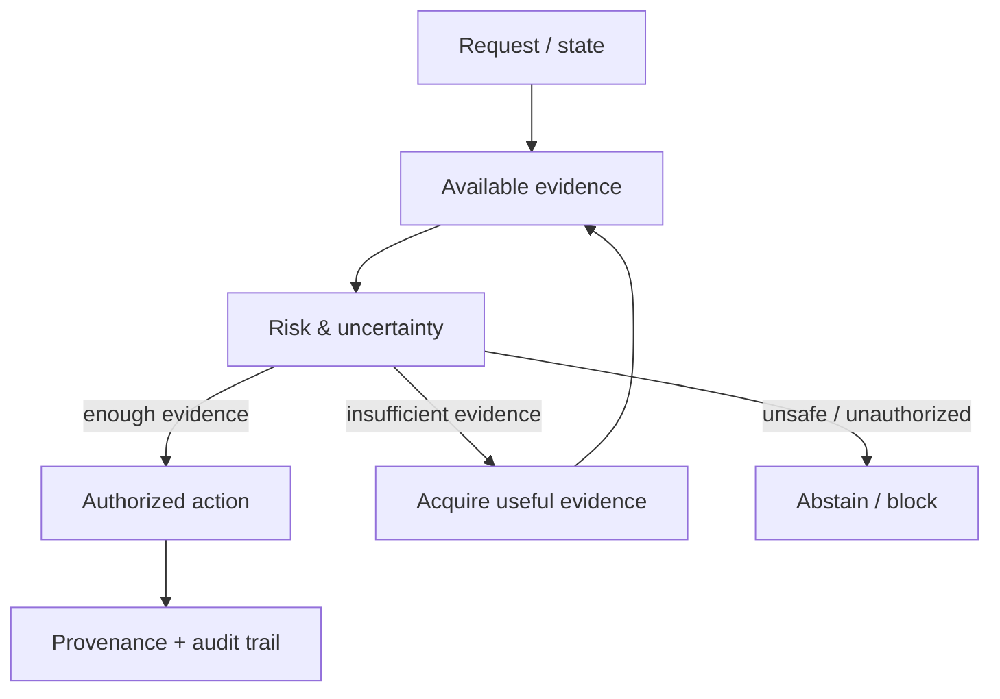

# GYRO Core / Oracle — AI Control Under Uncertainty

## Problem

Many AI systems can produce an answer even when the evidence is incomplete. GYRO Core explores a stricter question:

> What should an AI system do when it does not yet know enough to act safely?

## What I built

Control and risk layers around AI decisions, including concepts such as:

- active evidence acquisition
- value-of-information reasoning
- calibrated uncertainty
- abstention
- provenance
- capability / authorization boundaries
- fail-closed release behavior

The system is coupled to production infrastructure rather than living only as a research notebook.

## Production environment

- Oracle Compute
- Docker services
- PostgreSQL
- object storage
- Caddy ingress
- production + canary paths
- CI/CD and deployment gates
- health / readiness checks
- encrypted backup flows

## Architecture idea

## Engineering themes

- separating “the model thinks X” from “the system is allowed to do X”
- evidence acquisition only when it has expected value
- explicit uncertainty instead of silent guessing
- infrastructure gates that preserve the same safety semantics as the application layer
