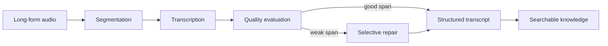

# Lecture Intelligence — Long-Form Speech AI

## Problem

Long recordings are expensive and slow to process naively. Errors are also uneven: some spans are good, while others need repair. Reprocessing the entire lecture wastes time and compute.

## What I built

A production-oriented pipeline for turning lectures and spoken content into structured, searchable knowledge:

- audio ingestion
- transcription
- silence / overlap handling
- segmentation
- transcript processing
- worker orchestration
- quality checks
- selective repair
- revision / approval flows
- searchable knowledge output

## Processing strategy

The important design choice is **targeted reprocessing**: weak regions can be repaired without paying the cost of rerunning the whole recording.

## Engineering themes

- long-running worker reliability
- measurable segmentation / transcription quality
- processing-time optimization
- selective retries rather than blanket recomputation
- revision approval before replacing trusted output
