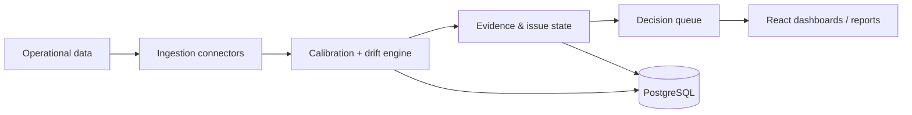

# OrgState — Operational Intelligence & Decision System

## Problem

Operational failures are often visible in data before they become obvious to management. OrgState is designed to detect **operational drift early**, explain the evidence behind it, and surface a ranked decision queue rather than another passive dashboard.

## What I built

A multi-tenant production system spanning:

- React + Vite customer/operator dashboards
- FastAPI service layer
- PostgreSQL persistence
- Docker deployment
- CSV / HTTP / SQL / SFTP ingestion paths
- evidence trails and decision queues
- API-key and SSO authentication
- audit logging and tenant isolation
- retention, usage metering and billing surfaces
- status, observability and load-testing infrastructure

## Tested evidence

In the tested pilot harness:

- **Precision: 1.0**
- **Recall: 0.917**
- **Mean lead time: +4.5 days** versus a naive 3-sigma dashboard baseline

The goal was not simply anomaly detection. The system had to produce evidence that a decision-maker could inspect and act on.

## Architecture

## Engineering themes

- robust per-tenant calibration rather than fixed magic thresholds
- evidence-linked decisions
- tenant isolation and auditability
- production APIs separated from domain logic
- fail-safe operational behavior
- measurable lead-time improvement rather than dashboard aesthetics

## Stack

Python · FastAPI · React · Vite · TypeScript · PostgreSQL · Docker · GitHub Actions

**Live demo:** https://orgstate.1bigfam.com
